# **EduVault Academic Management System**
## **Entity Relationship (ER) Diagram**

---

## **Complete ER Diagram - Mermaid Format**

```mermaid
erDiagram
    %% Core User Management
    USERS {
        int userId PK "Auto-increment primary key"
        nvarchar username UK "Unique username"
        nvarchar passwordHash "BCrypt hashed password"
        nvarchar email UK "Unique email address"
        nvarchar fullName "Complete user name"
        nvarchar roleName "ADMIN, FACULTY, STUDENT"
        bit isActive "Account status flag"
        datetime createdDate "Account creation timestamp"
        datetime lastLogin "Last login timestamp"
        nvarchar profilePicture "Profile image path"
    }
    
    %% Student Entity
    STUDENTS {
        nvarchar studentId PK "Format: YYYY-S-BB-XXX"
        int userId FK "References Users.userId"
        nvarchar fullName "Student full name"
        nvarchar email "Student email address"
        nvarchar phone "Contact phone number"
        int semester "Current semester (1-8)"
        int batch "Batch year"
        nvarchar session "Academic session"
        decimal cgpa "Cumulative GPA (0.00-4.00)"
        int totalCredits "Total credit hours earned"
        bit isActive "Student status flag"
        date admissionDate "Date of admission"
        date graduationDate "Date of graduation"
    }
    
    %% Faculty Entity
    FACULTY {
        nvarchar facultyId PK "Faculty identifier"
        int userId FK "References Users.userId"
        nvarchar fullName "Faculty full name"
        nvarchar email "Faculty email address"
        nvarchar designation "Professor, Assistant Prof, etc."
        nvarchar department "Department name"
        date joiningDate "Date of joining"
        bit isActive "Faculty status flag"
        nvarchar specialization "Area of expertise"
        nvarchar qualification "Educational qualifications"
    }
    
    %% Academic Sessions
    ACADEMIC_SESSIONS {
        int sessionId PK "Auto-increment primary key"
        nvarchar sessionName UK "Format: YYYY-YY"
        date startDate "Session start date"
        date endDate "Session end date"
        bit isActive "Session status flag"
        nvarchar description "Session description"
    }
    
    %% Courses Entity
    COURSES {
        int courseId PK "Auto-increment primary key"
        nvarchar courseCode UK "Unique course code"
        nvarchar courseName "Course title"
        int creditHours "Credit hours (1-6)"
        int semester "Target semester (1-8)"
        int batch "Target batch year"
        nvarchar session "Academic session"
        nvarchar facultyId FK "References Faculty.facultyId"
        bit isActive "Course status flag"
        nvarchar prerequisites "Prerequisite courses"
        nvarchar description "Course description"
        int maxEnrollment "Maximum enrollment capacity"
    }
    
    %% Enrollments (Many-to-Many relationship)
    ENROLLMENTS {
        int enrollmentId PK "Auto-increment primary key"
        nvarchar studentId FK "References Students.studentId"
        int courseId FK "References Courses.courseId"
        nvarchar session "Academic session"
        datetime enrollmentDate "Date of enrollment"
        bit isActive "Enrollment status flag"
        nvarchar enrollmentStatus "ENROLLED, DROPPED, COMPLETED"
        decimal finalGrade "Final course grade"
        nvarchar letterGrade "Letter grade (A+, A, B+, etc.)"
        decimal gradePoint "Grade point (0.00-4.00)"
    }
    
    %% Assessments Entity
    ASSESSMENTS {
        int assessmentId PK "Auto-increment primary key"
        nvarchar studentId FK "References Students.studentId"
        int courseId FK "References Courses.courseId"
        nvarchar assessmentType "QUIZ, MIDTERM, FINAL, ASSIGNMENT"
        decimal marks "Obtained marks"
        decimal maxMarks "Maximum possible marks"
        decimal weightage "Assessment weightage percentage"
        datetime submissionDate "Submission timestamp"
        bit isPublished "Publication status flag"
        nvarchar remarks "Additional comments"
        nvarchar gradedBy FK "References Faculty.facultyId"
        datetime gradedDate "Grading timestamp"
    }
    
    %% Attendance Entity
    ATTENDANCE {
        int attendanceId PK "Auto-increment primary key"
        nvarchar studentId FK "References Students.studentId"
        int courseId FK "References Courses.courseId"
        date attendanceDate "Date of attendance"
        nvarchar status "PRESENT, ABSENT, LATE, EXCUSED"
        nvarchar remarks "Additional notes"
        nvarchar markedBy FK "References Faculty.facultyId"
        datetime markedDate "Marking timestamp"
        nvarchar session "Academic session"
    }
    
    %% Notifications Entity
    NOTIFICATIONS {
        int notificationId PK "Auto-increment primary key"
        int userId FK "References Users.userId"
        nvarchar title "Notification title"
        nvarchar message "Notification content"
        nvarchar type "GRADE, ANNOUNCEMENT, ALERT, SYSTEM"
        bit isRead "Read status flag"
        datetime createdDate "Creation timestamp"
        datetime expiryDate "Expiration timestamp"
        nvarchar priority "HIGH, MEDIUM, LOW"
        nvarchar sourceType "SYSTEM, FACULTY, ADMIN"
    }
    
    %% System Settings
    SYSTEM_SETTINGS {
        int settingId PK "Auto-increment primary key"
        nvarchar settingKey UK "Setting identifier"
        nvarchar settingValue "Setting value"
        nvarchar description "Setting description"
        nvarchar category "ACADEMIC, SYSTEM, SECURITY"
        bit isActive "Setting status flag"
        datetime lastModified "Last modification timestamp"
        nvarchar modifiedBy "User who modified"
    }
    
    %% Audit Logs
    AUDIT_LOGS {
        int logId PK "Auto-increment primary key"
        int userId FK "References Users.userId"
        nvarchar action "Action performed"
        nvarchar tableName "Affected table name"
        nvarchar recordId "Affected record ID"
        nvarchar oldValues "Previous values (JSON)"
        nvarchar newValues "New values (JSON)"
        datetime timestamp "Action timestamp"
        nvarchar ipAddress "User IP address"
        nvarchar userAgent "User browser/client info"
    }
    
    %% Grade Scale Configuration
    GRADE_SCALE {
        int gradeId PK "Auto-increment primary key"
        nvarchar letterGrade UK "A+, A, A-, B+, etc."
        decimal minMarks "Minimum marks for grade"
        decimal maxMarks "Maximum marks for grade"
        decimal gradePoint "Grade point value"
        bit isActive "Grade scale status"
        nvarchar description "Grade description"
    }
    
    %% Course Prerequisites (Self-referencing)
    COURSE_PREREQUISITES {
        int prerequisiteId PK "Auto-increment primary key"
        int courseId FK "References Courses.courseId"
        int prerequisiteCourseId FK "References Courses.courseId"
        bit isMandatory "Whether prerequisite is mandatory"
        nvarchar description "Prerequisite description"
    }
    
    %% Relationships
    USERS ||--o{ STUDENTS : "has profile"
    USERS ||--o{ FACULTY : "has profile"
    USERS ||--o{ NOTIFICATIONS : "receives"
    USERS ||--o{ AUDIT_LOGS : "performs actions"
    
    STUDENTS ||--o{ ENROLLMENTS : "enrolls in"
    STUDENTS ||--o{ ASSESSMENTS : "takes"
    STUDENTS ||--o{ ATTENDANCE : "attends"
    
    FACULTY ||--o{ COURSES : "teaches"
    FACULTY ||--o{ ASSESSMENTS : "grades"
    FACULTY ||--o{ ATTENDANCE : "marks"
    
    COURSES ||--o{ ENROLLMENTS : "has students"
    COURSES ||--o{ ASSESSMENTS : "has assessments"
    COURSES ||--o{ ATTENDANCE : "tracks attendance"
    COURSES ||--o{ COURSE_PREREQUISITES : "has prerequisites"
    COURSES ||--o{ COURSE_PREREQUISITES : "is prerequisite for"
    
    ACADEMIC_SESSIONS ||--o{ COURSES : "contains"
    ACADEMIC_SESSIONS ||--o{ ENROLLMENTS : "manages"
    
    GRADE_SCALE ||--o{ ASSESSMENTS : "defines grading"
    GRADE_SCALE ||--o{ ENROLLMENTS : "determines final grade"
```



---

## **Detailed Entity Descriptions**

### **1. USERS Entity**
- **Purpose**: Central authentication and user management
- **Key Attributes**:
  - `userId`: Unique system identifier
  - `username`: Login identifier (must be unique)
  - `passwordHash`: Securely hashed password using BCrypt
  - `roleName`: Defines user type (ADMIN/FACULTY/STUDENT)
  - `isActive`: Enables/disables user account

### **2. STUDENTS Entity**
- **Purpose**: Student-specific information and academic tracking
- **Key Attributes**:
  - `studentId`: Formatted as YYYY-S-BB-XXX (Year-Semester-Batch-Sequence)
  - `cgpa`: Calculated cumulative grade point average
  - `totalCredits`: Sum of completed credit hours
  - `semester`: Current academic semester (1-8)

### **3. FACULTY Entity**
- **Purpose**: Faculty member information and course assignments
- **Key Attributes**:
  - `facultyId`: Unique faculty identifier
  - `designation`: Academic rank (Professor, Associate, Assistant)
  - `department`: Academic department affiliation
  - `specialization`: Area of expertise

### **4. COURSES Entity**
- **Purpose**: Course catalog and offering management
- **Key Attributes**:
  - `courseCode`: Unique course identifier (e.g., CSE311)
  - `creditHours`: Academic credit value
  - `maxEnrollment`: Enrollment capacity limit
  - `prerequisites`: Required prerequisite courses

### **5. ENROLLMENTS Entity**
- **Purpose**: Student-course relationship tracking
- **Key Attributes**:
  - `enrollmentStatus`: Current status (ENROLLED/DROPPED/COMPLETED)
  - `finalGrade`: Calculated final course grade
  - `letterGrade`: Letter grade assignment
  - `gradePoint`: GPA contribution

### **6. ASSESSMENTS Entity**
- **Purpose**: Individual assessment and grading records
- **Key Attributes**:
  - `assessmentType`: Type of assessment (QUIZ/MIDTERM/FINAL/ASSIGNMENT)
  - `weightage`: Percentage contribution to final grade
  - `isPublished`: Controls grade visibility to students
  - `gradedBy`: Faculty member who assigned the grade

### **7. ATTENDANCE Entity**
- **Purpose**: Daily attendance tracking
- **Key Attributes**:
  - `status`: Attendance status (PRESENT/ABSENT/LATE/EXCUSED)
  - `markedBy`: Faculty member who recorded attendance
  - `session`: Academic session identifier

---

## **Key Relationships and Constraints**

### **Primary Relationships**
1. **Users → Students/Faculty**: One-to-one relationship for user profiles
2. **Students ↔ Courses**: Many-to-many through Enrollments
3. **Faculty → Courses**: One-to-many (faculty teaches multiple courses)
4. **Students → Assessments**: One-to-many (student has multiple assessments)
5. **Courses → Assessments**: One-to-many (course has multiple assessments)

### **Business Rules and Constraints**
1. **Student ID Format**: Must follow YYYY-S-BB-XXX pattern
2. **Grade Constraints**: Marks must be ≤ maxMarks, CGPA between 0.00-4.00
3. **Semester Constraints**: Valid semester range 1-8
4. **Enrollment Limits**: Students cannot exceed maxEnrollment per course
5. **Assessment Weightage**: Total weightage per course must equal 100%

### **Referential Integrity**
- All foreign keys enforce referential integrity
- Cascade delete for dependent records (e.g., user deletion removes student profile)
- Soft deletes using `isActive` flags for data preservation

---

## **Database Indexes for Performance**

```sql
-- Primary performance indexes
CREATE INDEX IX_Students_Batch_Session ON Students(batch, session);
CREATE INDEX IX_Enrollments_Student_Course ON Enrollments(studentId, courseId);
CREATE INDEX IX_Assessments_Student_Course ON Assessments(studentId, courseId);
CREATE INDEX IX_Attendance_Student_Date ON Attendance(studentId, attendanceDate);
CREATE INDEX IX_Courses_Faculty ON Courses(facultyId);
CREATE INDEX IX_Users_Username ON Users(username);
CREATE INDEX IX_Users_Email ON Users(email);
CREATE INDEX IX_Notifications_User_Date ON Notifications(userId, createdDate);
```

---

## **Data Volume Estimates**

| Entity | Estimated Records | Growth Rate |
|--------|------------------|-------------|
| USERS | 2,000 | 500/year |
| STUDENTS | 1,500 | 400/year |
| FACULTY | 100 | 10/year |
| COURSES | 200 | 20/semester |
| ENROLLMENTS | 15,000 | 4,000/semester |
| ASSESSMENTS | 60,000 | 16,000/semester |
| ATTENDANCE | 300,000 | 80,000/semester |

---

## **Security and Audit Features**

### **Data Security**
- Password hashing using BCrypt (12 rounds)
- Sensitive data encryption at rest
- Role-based access control
- Session management with timeout

### **Audit Trail**
- Complete action logging in AUDIT_LOGS
- User activity tracking
- Data modification history
- IP address and timestamp recording

### **Data Integrity**
- Foreign key constraints
- Check constraints for valid ranges
- Unique constraints for business keys
- Trigger-based validation rules

---

**This ER diagram provides the complete foundation for the EduVault Academic Management System database, ensuring data integrity, performance optimization, and comprehensive audit capabilities.**
